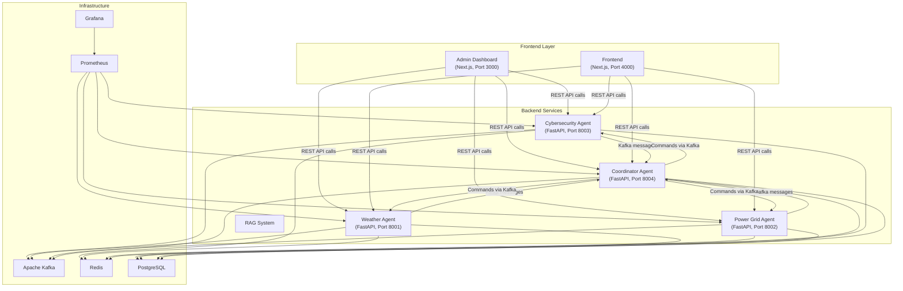

2# AI-Powered Smart Lighting System — Codebase Walkthrough

## Project Summary

This is a **multi-agent AI system** for intelligent smart city lighting management. It combines **cybersecurity**, **weather intelligence**, and **power grid optimization** — coordinated by a central **AI Coordinator** that uses an LLM (Groq) to make real-time decisions.

The system has **three layers**: backend microservices (Python/FastAPI), a public-facing frontend (Next.js), and a separate admin dashboard (Next.js).

---

## Architecture Overview

---

## Backend Services

### 1. Coordinator Agent (Port 8004)
**The brain of the system.** Consumes Kafka messages from all services and makes unified decisions.

| Component | File | Purpose |
|-----------|------|---------|
| FastAPI server | [backend/coordinator/src/main.py](file:///c:/Projects/Major_Project/AI_Powered_Smart_Lighting_System/backend/coordinator/src/main.py) | API endpoints (`/health`, `/state`), Kafka consumer thread, decision loop thread |
| LangGraph workflow | [backend/coordinator/src/graph/coordinator_graph.py](file:///c:/Projects/Major_Project/AI_Powered_Smart_Lighting_System/backend/coordinator/src/graph/coordinator_graph.py) | 2-node graph: **Priority Manager** → **Decision Engine** → produces lighting commands |
| Priority Manager | [backend/coordinator/src/agents/priority_manager.py](file:///c:/Projects/Major_Project/AI_Powered_Smart_Lighting_System/backend/coordinator/src/agents/priority_manager.py) | Evaluates alerts from all services, ranks by 9-level priority hierarchy |
| Decision Engine | [backend/coordinator/src/agents/decision_engine.py](file:///c:/Projects/Major_Project/AI_Powered_Smart_Lighting_System/backend/coordinator/src/agents/decision_engine.py) | Uses Groq LLM to generate context-aware lighting commands |

**Key flow:** Kafka messages arrive → update shared `system_state` dict → every 10 seconds, a decision loop triggers the LangGraph → Priority Manager identifies top concern → Decision Engine (LLM) generates a command → published back to Kafka's `coordinator_commands` topic.

### 2. Cybersecurity Agent (Port 8003)
Detects DDoS attacks and malware threats on the lighting infrastructure. Uses LangChain agents for real-time threat detection and response.

### 3. Weather Intelligence Agent (Port 8001)
Integrates with WeatherAPI for real-time weather data. Adjusts lighting based on conditions (wind, precipitation, visibility). Has disaster response protocols.

### 4. Power Grid Agent (Port 8002)
Manages energy consumption, load forecasting, outage detection, and grid optimization. Configurable thresholds for voltage, load, and energy budgets.

### 5. RAG System
Retrieval-Augmented Generation service for contextual knowledge queries.

---

## Frontend (Port 4000)

**Tech stack:** Next.js 15, React 19, Tailwind CSS 4, Leaflet (maps), Recharts (charts), Framer Motion (animations), Zustand (state), Socket.io

This is the **public-facing monitoring dashboard** — a mission-control-style interface with:
- Live street light map with Leaflet markers and heatmaps
- Cybersecurity dashboards (attack simulation, threat timeline)
- Power consumption charts and grid status views
- Weather trend visualization
- Blackout simulation and response visualization
- Real-time agent activity feeds

**77 source files** across views, components, charts, maps, and layout.

---

## Admin Dashboard (Port 3000) — *The MVP*

**Tech stack:** Next.js 16, React 19, Tailwind CSS 4, custom AdminLTE-inspired CSS

This is the **configuration and management dashboard** that your mentor reviewed. It has **7 pages**:

### Pages

| Page | Route | Purpose | Data Source |
|------|-------|---------|-------------|
| **Dashboard** | `/` | Service health, coordinator state, priority hierarchy | Live API (all 4 services) |
| **Zone Config** | `/zones` | CRUD for 8 lighting zones (brightness, type, priority, coordinates) | Client-side state only |
| **Cybersecurity** | `/cybersecurity` | DDoS + malware detection thresholds | Live API (port 8003) |
| **Weather** | `/weather` | Weather thresholds + feature toggles | Live API (port 8001) |
| **Power Grid** | `/power` | Voltage/load thresholds + optimization feature toggles | Live API (port 8002) |
| **Coordinator** | `/coordinator` | System mode, priority hierarchy, LLM config, decision engine status | Live API (port 8004) |
| **All Agents** | `/agents` | Filterable table of all 14 AI agents | Client-side static data |

### Key Files

- [api.ts](file:///c:/Projects/Major_Project/AI_Powered_Smart_Lighting_System/admindashboard/src/lib/api.ts) — Typed API layer with 5s timeout, health checks, service-specific fetch functions
- [Sidebar.tsx](file:///c:/Projects/Major_Project/AI_Powered_Smart_Lighting_System/admindashboard/src/components/layout/Sidebar.tsx) — AdminLTE-style sidebar with 7 nav items + system status footer
- [globals.css](file:///c:/Projects/Major_Project/AI_Powered_Smart_Lighting_System/admindashboard/src/app/globals.css) — 697-line custom CSS mimicking AdminLTE (cards, info boxes, small boxes, badges, toggle switches, tables, progress bars, grid system)

### Current MVP Limitations

1. **Save is simulated** — All pages have "Save Configuration" buttons but they just `setTimeout` for 1 second and show a success message. No PUT/POST to backend.
2. **Zone data is client-side** — 8 hardcoded zones, not fetched from any API.
3. **Agent data is static** — The `/agents` page uses a hardcoded array of 14 agents.
4. **Sidebar status is hardcoded** — Footer shows all services as "online" regardless of actual status.
5. **No authentication/authorization** — No login, no role-based access.
6. **No charts or data visualization** — All pages are form-based, no graphs.
7. **Dashboard metrics partially hardcoded** — "14 Active Agents", "8 Configured Zones", "0 Active Alerts" are static values.

---

## Infrastructure (Docker Compose)

All services are containerized and communicate over a shared Docker network (`smart-lighting-network`):

| Service | Image/Build | Port |
|---------|-------------|------|
| Zookeeper | `confluentinc/cp-zookeeper:7.4.0` | 2181 |
| Kafka | `confluentinc/cp-kafka:7.4.0` | 9092 |
| Redis | `redis:7-alpine` | 6379 |
| PostgreSQL | `postgres:15-alpine` | 5432 |
| Prometheus | `prom/prometheus:latest` | 9090 |
| Grafana (main) | `grafana/grafana:latest` | 3000 |
| Grafana (power) | `grafana/grafana:latest` | 3002 |
| Kafka UI | `provectuslabs/kafka-ui:latest` | 8080 |

---

## Environment Variables

From [.env](file:///c:/Projects/Major_Project/AI_Powered_Smart_Lighting_System/.env) at root: `GROQ_API_KEY`, `WEATHERAPI_API_KEY`

---

## How It All Connects

1. Backend services run independently, each with their own AI agents (LangChain/LangGraph)
2. Services publish alerts, reports, and forecasts to **Kafka topics**
3. The **Coordinator** consumes all Kafka topics, aggregates state, and runs a LangGraph every 10 seconds
4. The LangGraph identifies the **primary concern** (9-level priority) and uses an **LLM** to generate lighting commands
5. Commands are published back to Kafka for services to act on
6. The **Frontend** provides real-time monitoring and visualization
7. The **Admin Dashboard** provides configuration and management of all services and agents
